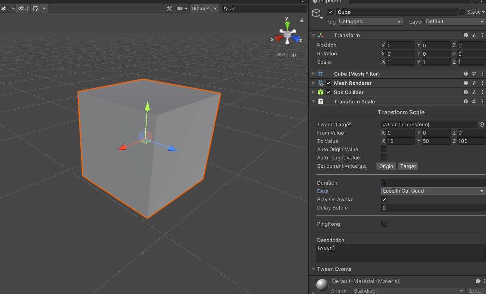

# TinaX Framework - Tween.


[-blue.svg)](https://github.com/996icu/996.ICU/blob/master/LICENSE)
<a href="https://996.icu"></a>
[](https://github.com/yomunsam/TinaX/blob/master/LICENSE)

<!-- [](https://github.com/yomunsam/TinaX/blob/master/LICENSE) -->


[TinaX](https://github.com/yomunsam/TinaX) is a Unity-based framework, simple , complete and delightful, ready to use.

TinaX provides functionality in the form of "Unity packages". 

`TinaX.Tween` provides a lightweight tween animation library for [TinaX Framework](https://github.com/yomunsam/TinaX).

- Lightweight tween animation library
- Tween animation components that can be used without coding

<br>

package name: `io.nekonya.tinax.tween`

<br>

------


## QuickStart

> The core function of this library is based on [TweenRx](https://github.com/fumobox/TweenRx) (MIT license). You can also directly visit TweenRx's repo to view relevant documents.

<br>

### Simple float animation

``` csharp
using UniRx;
using TinaX.Tween;

Tween.Play(1, 10)
    .Subscribe(value =>
    {
        gameObject1.transform.localPosition = new Vector3(x, 0, 0);
    });
```

<br>

### Tween component

We can use components in the editor without coding to achieve tween animation function.




For more usage, please [see the document](https://tinax.corala.space).

<br>

------

## Install

Please visit the documentation for installation instructions：[Install TinaX](https://tinax.corala.space/#/cmn-hans/tinax/install/install_tinax)


<br><br>
------

## Dependencies

- [io.nekonya.tinax.core](https://github.com/yomunsam/tinax.core) :`git://github.com/yomunsam/TinaX.Core.git`

<br><br>

------

## Learn TinaX

You can find out how to use the various features of TinaX in the [documentation](https://tinax.corala.space)

------

## Third-Party

The following excellent third-party libraries are used in this project:

- **[TweenRx](https://github.com/fumobox/TweenRx)** : (MIT License)Reactive animation utility for Unity.
